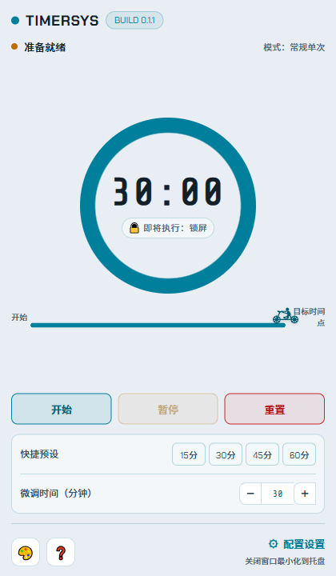
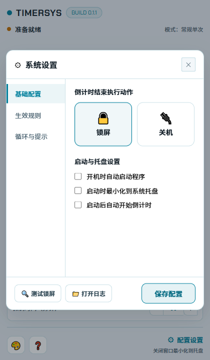

# TimerApp

Windows 定时提醒与系统动作工具。到点后自动锁屏或关机，支持托盘驻留、离线激活与灵活的生效规则。

基于 **Rust + Tauri 2** 构建，界面提供深色、明亮、鲜艳三种风格。

## 界面预览

<p align="center">
  
</p>

<p align="center"><em>主界面 — 圆环倒计时、快捷预设、步进器微调与底栏主题/帮助/配置入口</em></p>

<p align="center">
  
</p>

<p align="center"><em>系统设置 — 侧栏式弹窗：基础配置、生效规则、循环与提示</em></p>

## 功能

- 自定义倒计时（15/30/45/60 分钟或 1–1440 分钟）
- 提前通知、延后执行、循环休息
- 锁屏 / 关机、时间段与星期生效规则
- 系统托盘、开机自启、退出密码保护
- 离线激活码
- 三种界面风格（深色 / 明亮 / 鲜艳），左下角一键切换

## 环境要求

- Windows 10/11 x64
- [Rust](https://rustup.rs/) stable
- [Node.js](https://nodejs.org/) 20+
- Visual Studio Build Tools（「使用 C++ 的桌面开发」）

## 快速开始

```bash
git clone https://github.com/gradient30/timer.git
cd timer
./scripts/dev.sh setup-config
# 编辑 config/local/activation.env（勿提交）
cd timer && npm install
./scripts/dev.sh dev
```

开发服务器默认端口 `1422`（见 `timer/src-tauri/tauri.conf.json`）。

## 常用命令

```bash
./scripts/dev.sh dev          # 开发模式
./scripts/dev.sh check        # 代码检查
./scripts/dev.sh icons        # 重新生成时钟图标
./scripts/dev.sh release      # 构建公开发布 MSI
./scripts/dev.sh activation 5 # 生成激活码（与 release 同密钥即可用于对应 MSI）
```

命令说明见 [scripts/README.md](scripts/README.md)。

## CI/CD

推送 `main` 或开 PR 时，GitHub Actions 自动执行与本地等价的检查：

- **check**：`npm build` + `dev.sh check` + `dev.sh test`（含 `activation-admin`）
- **release-parity**：无 `activation-admin` 的 `cargo check/clippy`

推送 `v*` 标签自动构建 MSI 并创建 [GitHub Release](https://github.com/gradient30/timer/releases)。

**首次启用**：配置 `github` 远程 → 推送 `main` →（Release 前）在仓库 Settings 配置 Secrets。  
完整步骤见 [docs/release/RELEASE.md#零github-actions-操作步骤](docs/release/RELEASE.md#零github-actions-操作步骤)。

## 文档

| 文档 | 说明 |
|------|------|
| [docs/release/RELEASE.md](docs/release/RELEASE.md) | 发布流程与 **CI/CD 操作步骤** |
| [docs/release/CONFIGURATION.md](docs/release/CONFIGURATION.md) | 配置与构建密钥 |
| [docs/activation/USAGE.md](docs/activation/USAGE.md) | 激活码生成与使用 |
| [config/README.md](config/README.md) | 配置目录 |

## 目录结构

```
├── config/public/       # 公开配置模板
├── config/local/        # 本地构建密钥（gitignore）
├── docs/                # 使用与发布文档
│   └── assets/          # README 展示截图
├── scripts/dev.sh       # 开发/构建/发码脚本
└── timer/               # Tauri 应用（前端 + src-tauri）
```

## License

[MIT](LICENSE)
